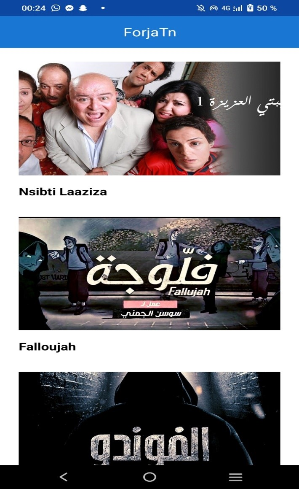
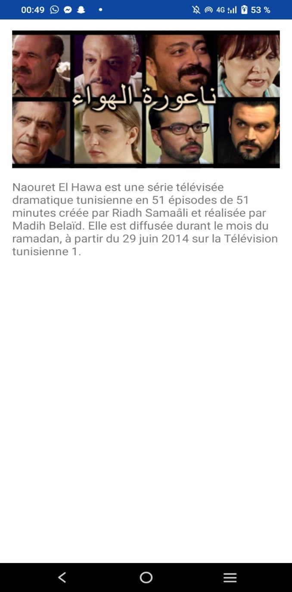

# Forja TN  
**Application Android pour cataloguer des séries tunisiennes**  

Forja TN est une application Android statique, développée en Kotlin avec Android Studio, permettant de cataloguer et d'explorer les séries tunisiennes.  

---

## Fonctionnalités principales  
- Affichage d'une liste de séries tunisiennes.  
- Informations détaillées pour chaque série : titre, année, synopsis, etc.  


---

## Aperçu de l'application  

### **Écran d'accueil**  
  
*Description : Aperçu de la liste des séries.*  

### **Détail d'une série**  
  
*Description : Informations détaillées sur une série spécifique.*  

---

## Technologies utilisées  
- **Langage :** Kotlin  
- **IDE :** Android Studio  
- **Architecture :** Application statique  

---

## Installation et exécution  
1. Clonez ce dépôt :  
   ```bash  
   git clone https://github.com/raniasouissi/Forja-TN---Application-Android-pour-cataloguer-des-s-ries-tunisiennes.git  
