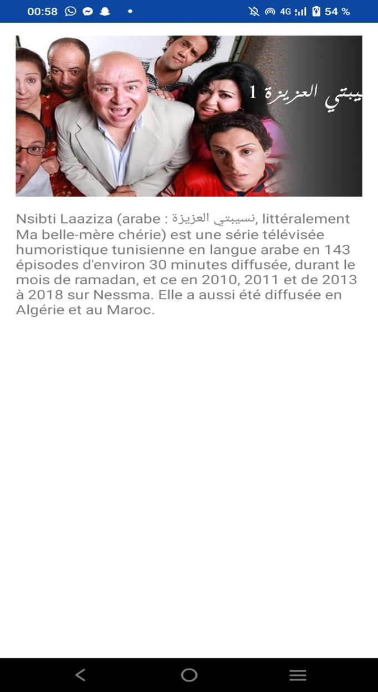

# Forja TN  
**Android Application for Cataloging Tunisian TV Series**  

Forja TN is a static Android application, developed in Kotlin with Android Studio, allowing users to catalog and explore Tunisian TV series.  

---

## Main Features  
- Display a list of Tunisian TV series.  
- Detailed information for each series: title, year, synopsis, etc.  

---

## Application Preview  

### **Home Screen**  
  

### **Series Details**  
  

---

## Technologies Used  
- **Language:** Kotlin  
- **IDE:** Android Studio  
- **Architecture:** Static Application  

---

## Installation & Execution  
1. Clone this repository:  
   ```bash  
   git clone https://github.com/raniasouissi/Forja-TN---Android-Application-for-Cataloging-Tunisian-TV-Series.git  
